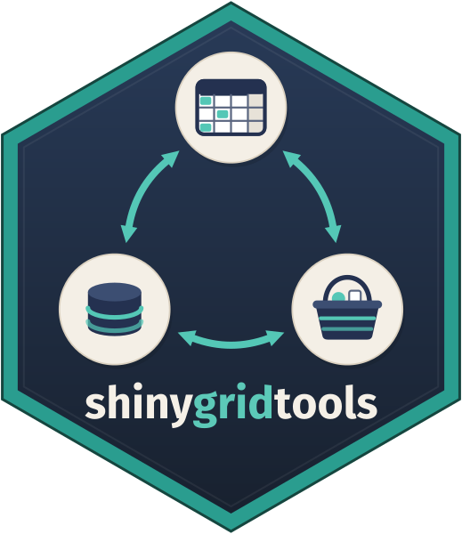
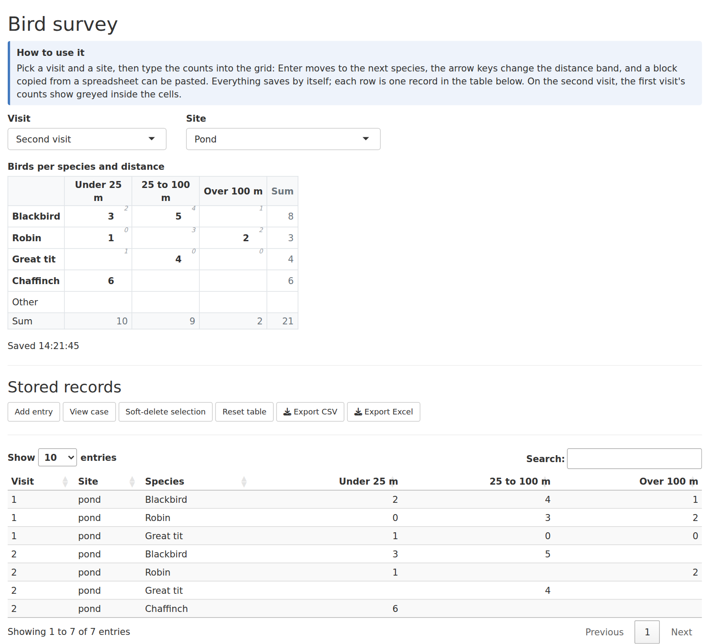
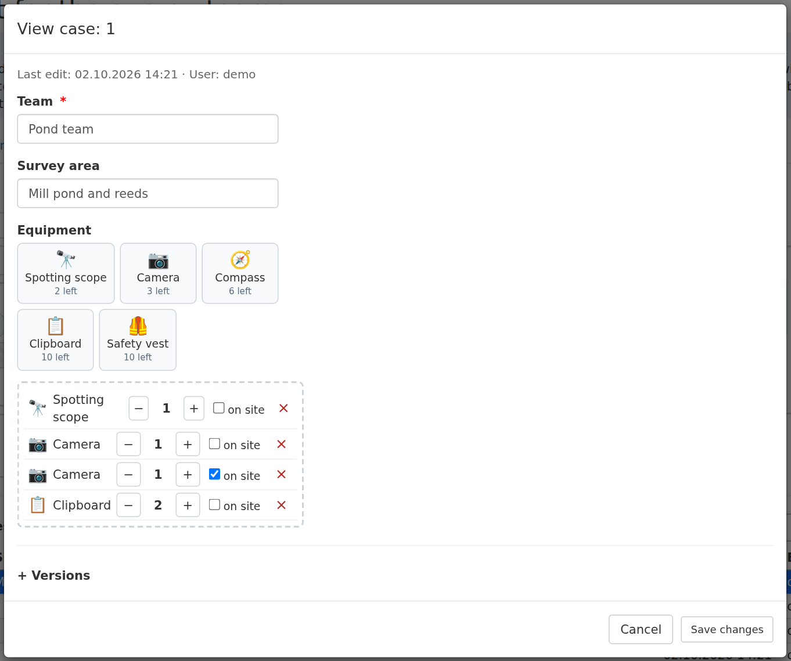
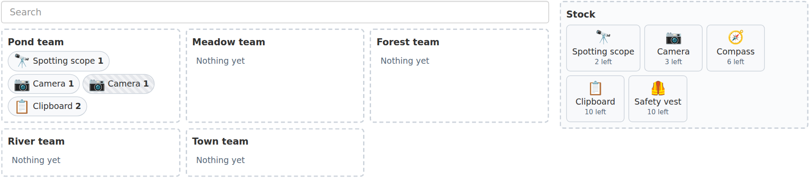

# shinygridtools 

<!-- badges: start -->
[](https://github.com/Gwstat/shinygridtools/actions/workflows/R-CMD-check.yaml)
[](https://lifecycle.r-lib.org/articles/stages.html#experimental)
<!-- badges: end -->

`shinygridtools` enters many records of a
[shinyformtools](https://github.com/Gwstat/shinyformtools) form at once. Where
shinyformtools opens a dialog for one record, shinygridtools shows a whole
group of records as a **spreadsheet-like grid**: the species counted at one
survey site, the items of one order, the scores of one round. The user types,
pastes a block from Excel, and the grid saves what changed, half a second
after the last keystroke, in one transaction.

Its second tool is the **basket**: a form field that holds items from a
palette, with a stock that every record shares. Lending equipment to field
teams, handing out devices to classes, booking rooms from a pool:
the remaining count shows on each item, a save that would take more than is
left is refused, and a **board** moves pieces between records by drag and
drop.

Both are built on the extension API of shinyformtools, so they behave like
the rest of a shinyformtools app: every write is validated and audit-logged,
permissions and per-user `editable` rules apply, and the labels follow
`german()` / `english()`.

<p align="center">
  
  
</p>
<p align="center">
  
</p>
<p align="center"><em>The example apps <code>app_grid_entry</code> (top left) and
<code>app_cart_input</code> (top right, bottom).</em></p>

## Background

The grid and the basket started inside shinyformtools, for field data
collection where one visit produces many numbers at once, and for handing out
the equipment the people in the field need. They outgrew the core package and moved here in October 2026,
so that shinyformtools stays a small, declarative form package and this one
can grow on its own. shinygridtools depends on shinyformtools; shinyformtools
does not know about it.

Like shinyformtools, it was developed with Claude Code as an AI-assisted
development tool for implementation, refactoring and testing. The package is
maintained by me and is at an early stage. Suggestions and bug reports are
very welcome.

## Related work

[rhandsontable](https://github.com/jrowen/rhandsontable) and editable
[DT](https://rstudio.github.io/DT/) tables edit a data frame in the browser;
[editbl](https://github.com/openanalytics/editbl) edits database tables;
[shinyMatrix](https://github.com/INWTlab/shiny-matrix) is a matrix input;
[sortable](https://github.com/rstudio/sortable) provides drag and drop.
shinygridtools differs in what sits behind the cells: each row (or cell) is a
record of a shinyformtools form, saved with that form's validation, audit log,
permissions and conflict checks, and kept in step with what other users save.

## Features

- **Grid entry over records** with `grid_ui()` / `grid_server()`: one record
  per grid row (wide) or one record per cell (long, `col_key`), grouped by any
  fields of the form.
- **Spreadsheet keyboard**: Enter and the arrow keys walk the cells, a block
  copied from Excel or LibreOffice is pasted from the focused cell onwards
  (thousands separators understood), row, column and total sums follow the
  entries.
- **Autosave of what changed**: half a second after the last keystroke, or on
  a Save button; new rows are inserted, emptied rows soft-deleted, untouched
  rows not written. All in one transaction through
  `shinyformtools::upsert_records()`.
- **Several people on one group**: a changed cell is saved only if it is still
  stored the way the grid showed it; others' entries appear every few seconds
  (`poll`) without touching the cell the user is typing in.
- **Hints**: a matrix shown greyed inside the cells, for example yesterday's
  counts, never saved.
- **Permissions**: `can_add`, `can_edit`, `can_delete` and `editable_fields`
  as in `form_server()`; locked columns show their values and take no input.
- **`grid_input()`** on its own: a grid of number cells as a Shiny input, and
  as the field type `input_type = "grid_input"`, stored as one JSON text with
  its row and column names.
- **Basket field** `input_type = "cart_input"`: items dragged or clicked from a
  palette, counted with `+` / `-`, marked as kept on site. The palette is a
  fixed list or another form (`cart_catalog()`) with name, emoji and stock.
- **Shared stock**: one stock per catalog across every basket of every form;
  checked on save, upsert and restore, also when two people take the last
  piece at the same moment (MariaDB lock per stock).
- **Board**: `cart_board_ui()` or `form_ui(show_board = TRUE)` shows every
  record next to the stock; one drag moves one piece, saved at once.

## Installation

```r
# install.packages("remotes")
remotes::install_github("Gwstat/shinygridtools")
```

This installs shinyformtools along with it. `library(shinygridtools)` attaches
both.

## Minimal example: a grid

```r
library(shiny)
library(shinygridtools)

counts <- form(
  form_id = "counts", table_name = "counts",
  db = db_sqlite("counts.sqlite"),
  fields = list(
    form_field(id = "site", label = "Site"),
    form_field(id = "species", label = "Species"),
    form_field(id = "adults", label = "Adults", input_type = "numericInput"),
    form_field(id = "juveniles", label = "Juveniles", input_type = "numericInput")
  )
)

ui <- fluidPage(
  selectInput("site", "Site", c("Pond", "Meadow")),
  grid_ui("counts", label = "Birds per species"),
  form_ui("table", title = "Stored records")
)

server <- function(input, output, session) {
  grid <- grid_server(
    "counts", counts,
    rows = c("Blackbird", "Robin", "Great tit"), key = "species",
    group = reactive(list(site = input$site)), user = "demo"
  )
  # The regular shinyformtools table of the same records, kept in step.
  form_server("table", counts, user = "demo", refresh_triggers = grid$changed)
}

shinyApp(ui, server)
```

## Minimal example: a basket

```r
library(shiny)
library(shinygridtools)

db <- db_sqlite("equipment.sqlite")

items <- form(
  form_id = "items", table_name = "items", db = db,
  fields = list(
    form_field(id = "code", label = "Code", unique = TRUE),
    form_field(id = "name", label = "Name"),
    form_field(id = "emoji", label = "Icon"),
    form_field(id = "stock", label = "Stock", input_type = "numericInput")
  )
)

teams <- form(
  form_id = "teams", table_name = "teams", db = db,
  fields = list(
    form_field(id = "team", label = "Team"),
    form_field(
      id = "equipment", label = "Equipment", input_type = "cart_input",
      args = list(catalog = cart_catalog(items, id = "code", label = "name",
                                         icon = "emoji", stock = "stock"))
    )
  )
)

ui <- fluidPage(
  tabsetPanel(
    tabPanel("Teams", form_ui("teams", show_board = TRUE)),
    tabPanel("Items", form_ui("items"))
  )
)

server <- function(input, output, session) {
  form_server("teams", teams, user = "demo")
  form_server("items", items, user = "demo")
}

shinyApp(ui, server)
```

The vignette, `vignette("shinygridtools")`, walks through both tools and shows
what lands in the database.

## Example apps

```r
list_examples()
run_example("app_grid_entry")
```

- **app_grid_entry**: a bird survey. Birds are counted per site, species and
  distance band on two visits; on the second visit the first visit's counts
  show greyed inside the cells, and the regular form module below lists the
  same records. Open it in two windows on the same site to see the other
  window's entries appear and a clash in one cell refused.
- **app_cart_input**: survey teams borrow equipment from a shared store. The
  palette comes from a second form with name, emoji and stock; the board
  above the table moves pieces between teams and back to the store.

## How it fits with shinyformtools

shinygridtools needs shinyformtools 0.10.0 or newer. It registers its two
field types, its texts in English and German, and the board with
shinyformtools when it is loaded, through the extension API
(`register_input()`, `register_texts()`, `register_ui_part()`). Apps attach it
with `library(shinygridtools)`; shinyformtools itself never loads it.

Up to shinyformtools 0.8.0 the grid and the basket were part of shinyformtools.
The R functions and their arguments are unchanged; stored values read the
same. Names the browser sees changed: the CSS classes are `sgt-grid-*`,
`sgt-cart-*` and `sgt-board-*` (were `sft-*`).

## Contributing

Bug reports, ideas and pull requests are welcome; see
[CONTRIBUTING](.github/CONTRIBUTING.md).

## License

MIT, see [LICENSE](LICENSE).
